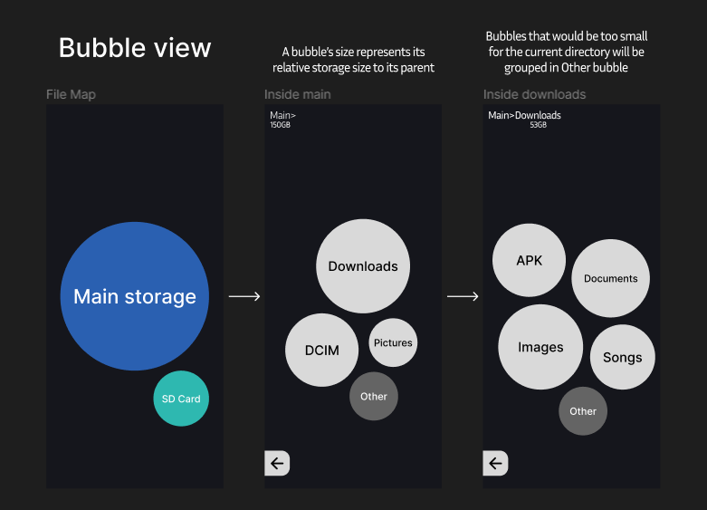

# FileMap

## Overview

FileMap is a file explorer app project in progress. 

## Libraries

- Android
- Jetpack Compose
- Android SAF (Storage Access Framework)

## Mockup




## Getting Started

Copy the project and run it either in an emulator or a physical device.

### Prerequisites

- Android Studio / Intellij IDEA
- Android Emulator or a device with Api Level 24+

### Running the project

1. Clone the repository:

    ```bash
    git clone https://github.com/Santiago15JM/filemap.git
    ```

2. Make sure that the gradle project is synced

3. Run the app